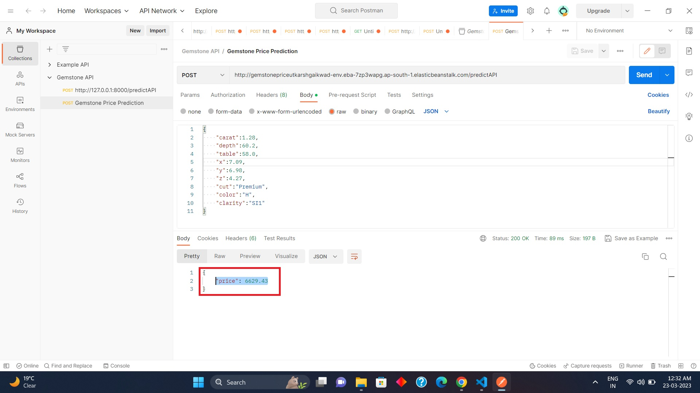

# End to End Gemstone Price Prediction using CICD pipelines

## Introduction About the Data:

The goal of this project is to predict the price of a given diamond using a **regression analysis** approach. The dataset provided contains various features that describe the characteristics of diamonds, which are used to predict their market value.

### The dataset includes **10 independent variables** (including `id`):

- **`id`**: Unique identifier for each diamond.
- **`carat`**: Carat (ct.) is a unit of weight measurement used exclusively for gemstones and diamonds.
- **`cut`**: The quality of the diamond's cut.
- **`color`**: The color of the diamond.
- **`clarity`**: The purity and rarity of the diamond, graded by the visibility of inclusions under 10x magnification.
- **`depth`**: The height of the diamond, measured from the culet (bottom tip) to the table (top flat surface).
- **`table`**: The facet visible when the diamond is viewed face up.
- **`x`**: Diamond's X dimension (length).
- **`y`**: Diamond's Y dimension (width).
- **`z`**: Diamond's Z dimension (depth).

### Target Variable:

- **`price`**: The market price of the given diamond.

### Dataset Source:

You can access the dataset for this project from Kaggle:  
[Gemstone Price Prediction Dataset](https://www.kaggle.com/competitions/playground-series-s3e8/data?select=train.csv)

---

## Observations:

It has been observed that the categorical variables **'cut'**, **'color'**, and **'clarity'** are ordinal in nature, meaning they represent categories with a meaningful order.

For more details on the grading system for diamonds, check out the [American Gem Society](https://www.americangemsociety.org/ags-diamond-grading-system/).

---

## Postman Testing of API:

Below is an image showcasing the **API's** ability to predict gemstone prices when tested through **Postman**:

---

## Approach for the Project:

The following approach was used for the entire gemstone price prediction project:

### 1. **Data Ingestion:**

- In the **data ingestion** phase, the dataset is first read from the CSV file.
- The data is then split into **training** and **testing** sets and saved as separate CSV files.

### 2. **Data Transformation:**

A **ColumnTransformer Pipeline** is created to handle both numerical and categorical variables.

#### For Numerical Variables:
- A **SimpleImputer** is applied using the **median** strategy to handle missing values.
- **Standard Scaling** is performed on the numerical data.

#### For Categorical Variables:
- A **SimpleImputer** is applied using the **most frequent** strategy to handle missing values.
- **Ordinal Encoding** is performed on the categorical data.
- **Standard Scaling** is applied to standardize the categorical data.

- The preprocessor is then saved as a **pickle** file for future use.

### 3. **Model Training:**

- During the model training phase, various models are tested. The best-performing model was the **CatBoost Regressor**.
- **Hyperparameter tuning** was conducted on both the **CatBoost** and **K-Nearest Neighbors (KNN)** models.
- A **Voting Regressor** was created to combine the predictions of **CatBoost**, **XGBoost**, and **KNN** models, improving overall accuracy.
- The final model is saved as a **pickle** file for easy loading and prediction.

### 4. **Prediction Pipeline:**

- The **prediction pipeline** is designed to convert incoming data into a DataFrame, load the saved pickle files, and make predictions based on the input features.
- The final price prediction is returned after applying the trained models.

### 5. **Flask App Creation:**

- A **Flask Web Application** is created to allow users to interact with the gemstone price prediction model via a user-friendly interface.
- The app provides a convenient way to predict gemstone prices by inputting the relevant data into the web form, which is then processed by the backend model.

---

## Conclusion:

This project demonstrates how **machine learning models**, particularly **regression algorithms**, can be used to predict the price of diamonds based on various physical characteristics. The entire pipeline—from **data ingestion** and **transformation** to **model training** and **deployment**—has been automated to provide accurate and efficient predictions, accessible through a **Flask-based web application**.

---

### **Technologies Used:**

- **Machine Learning Algorithms**: CatBoost, XGBoost, KNN, Voting Regressor
- **Libraries**: Scikit-learn, Pandas, NumPy
- **Web Framework**: Flask
- **Tools**: Postman for API testing
- **Cloud Platforms**: AWS, Azure (for deployment)

---
